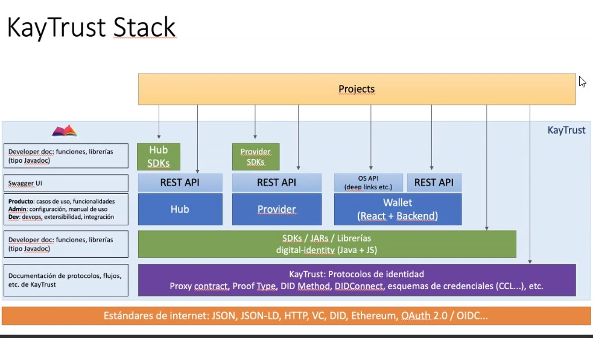

# KayTrust Developer Space

## What is KayTrust?
KayTrust is a complete digital identity solution comprised of:

- A set of [technical specifications](Specs) based on Internet standards
- Reference implementations:
  - [Libraries](SDK) (currently for Java and Javascript/NodeJS) to make implementation of core KayTrust specs easier for developers.
  - Ready-to-use software built on top of the libraries:
    - [KayTrust Wallet](Wallet). A mobile Wallet for users (free of charge).
    - [KayTrust Provider](Provider). An enterprise server suite for organisations that wish to issue and manage credentials with minimal effort.

## What does Digital Identity mean?
Identity refers to 2 things:
- **Identifiers**, i.e. unique and non-ambiguous strings used to _refer_ to people, organizations, vehicles, building, etc. An email address, a phone number, a national ID number, a nickname or a physical address are all identifiers within a certain system.
- **Claims**, i.e. _what_ is said about those entities. It's also usually important to consider _who_ says those things. For example "Individual with ID number 123 can drive" is useless without the information (and proof) of who claims it – typically a government entity. A set of claims, packed along with an issuing entity's identifier and a way to verify the whole thing, is called a **credential**.

## The vision of decentralised digital identity

It is important to understand the vision behind self-sovereign identity: **nobody (no company, not any government, etc.) may control, block, censure, delete or spoof users' identity, restrict what users may do with their identity, or access information that users didn't agree to share.**

KayTrust achieves that by using a **decentralised trust repository** (typically a blockchain) for identifiers, for credential proofs, and for sharing consent. The repository itself only stores proofs of data integrity. No private information is stored on the shared repository, so KayTrust works on public repositories such as public blockchains.

For more information, please visit [kaytrust.id](https://www.kaytrust.id/).

## What does the KayTrust Developer Space offer?

The purpose of this space is to make life easy for developers. You will find:
- Core [KayTrust specifications](Specs)
- Method references for the [libraries](SDK) that implement the core specs.
- Documentation on how to interact with KayTrust Wallet as a developer.
- Documentation on how to install, configure, use and extend KayTrust Provider

Not all the documentation is available yet at this developer space is new, so please bear with us!

## KayTrust Stack

